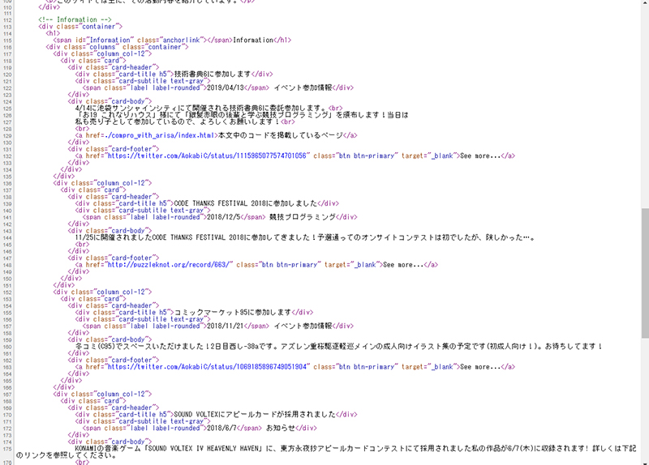
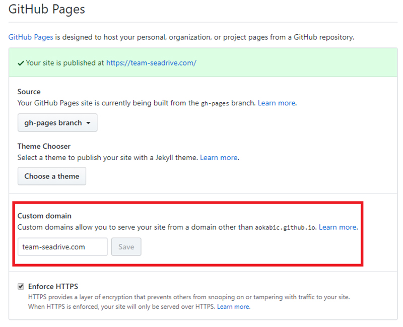

碧黴(あおかび)です。
ブログを作りました。Reactなんもわからん太郎なのでまだ残念な感じですが、そのうち体裁を整えていきます。

## 動機
自分の活動を紹介するサイトは(同人作家でもあるので)前々から作ってはいた。


CSSフレームワーク([Spectre.css](https://picturepan2.github.io/spectre/getting-started.html))を使って見た目にもそれなりにこだわっていたが、地味にアップデートが面倒だった(途中でGithub Pagesに移行したため、アプデ自体はpushするだけになったけども)。
中身がHTML直書きなので、つらい気持ちになる。



それと、ブログ機能が欲しくなっていた。競プロ大会の参加記とかは大学の競プロサークルのブログ(Wordpress)に書いていたものの、さすがにそれ以外の話題は書けない。

というわけで、モダンな技術を使ってブログ込みのサイトにリニューアルすることに。前々からVue.jsを使ったことはあったので、そのあたりを探してみる。

結果的に、見つかったのは以下のあたり。

+ VuePress  
+ Gridsome
  * これらはVue製のジェネレータ。
+ GatsbyJS
  * React製のジェネレータ。
  
Githubのスター数、プラグインやスターター、Docsの充実っぷりもそうだが、公式サイトのレスポンスの良さに惹かれたのでGatsbyJSを採用した。超速い。
Reactを触るいい機会にもなりそう、という魂胆もある。

## 使った技術

[GatsbyJS](https://www.gatsbyjs.org/) - React製静的サイトジェネレータ。爆速。

[Github Pages](https://pages.github.com/) - GitHubが提供しているWebページホスティングサービス。

[styled-components](https://www.styled-components.com/) - JSでstylingするCSS in JSライブラリ。

## やったこと

スターターとして使ったのは、[gatsby-starter-blog](https://github.com/AokabiC/gatsby-starter-blog)。前のサイトの見た目に近づけるため、Spectre.cssのコードを読みながらそれっぽくNavbarとかのcomponentを作る。

Vueの場合は単一ファイルコンポ-ネント(.vueってファイル)によってstylingも1つのファイルで完結していたので、できるだけそれっぽく書けそうなstyled-componentsを使った。

一通り作って、gh-pagesというnpmパッケージを用いてGithub Pagesにデプロイした。
デプロイのやり方自体はすごく簡単で、`package.json` の `scripts` 内に

```json
"deploy": "gatsby build && gh-pages -d public"
```

と書いて、`npm run deploy` するだけ(少しハマったけど)(後述)。

## ハマったこと

#### Imageの挙動
Gatsbyには画像を最適化してくれる(デバイスサイズに合わせた画像サイズ、読み込み前にスペースを確保してレイアウト崩れを防ぐ、とか)プラグインがある。スターターにも最初から入っていて、blog内に配置した画像を最適化してくれる。

記事内の画像(Markdown内に配置した画像)は[gatsby-remark-images](https://www.gatsbyjs.org/packages/gatsby-remark-images/?=remark%20ima)によってレスポンシブに表示されるが、それ以外で最適化の恩恵を受けるにはgatsby-imageというプラグインを使う。GraphQL経由で画像を渡すが、このときに固定サイズ(Fixed)か動的に変化させる(Fluid)かを指定する([参照](https://www.gatsbyjs.org/docs/gatsby-image/#types-of-images-with-gatsby-image))。

配置されるコンテナいっぱいに画像が広がるっぽいが、flexbox内に置くなら`flex-grow`を指定しておかないと画像が表示されない(サイズが0になる)。
トップページの画像をスライドショーっぽくしたくていろいろ試行錯誤したものの、Fluidの挙動を理解しきれずとりあえず保留。

<br/>

#### デプロイして確認すると一部のStyleが当たっていない
これはGatsbyでstyled-componentsを使う場合の注意点っぽくて、[gatsby-plugin-styled-components](https://www.gatsbyjs.org/packages/gatsby-plugin-styled-components/)を導入しないとStyleの読み込み順がdevelop環境と異なる現象が起こるらしい？

参考:[https://github.com/gatsbyjs/gatsby/issues/9911](https://github.com/gatsbyjs/gatsby/issues/9911)

<br/>

#### GitHub Pagesにデプロイしたタイミングで設定したドメインが上書きされる



GitHub Pagesにはカスタムドメインを割り当てられるが、gh-pagesを使ってデプロイするとデフォルトに上書きされてしまう。

回避するには、生成した`public`ディレクトリ内にドメイン名を書いた`CNAME`ファイルを追加する。つまり、デプロイのコマンドをこうする。

```json
"deploy": "gatsby build && echo \"example.com\" > public/CNAME && gh-pages -d public"
```

参考: [https://github.com/tschaub/gh-pages/issues/213](https://github.com/tschaub/gh-pages/issues/213)

## まとめ
マークダウンでブログを書けて、コマンド一発で反映できて便利。しかも爆速。悪くない。