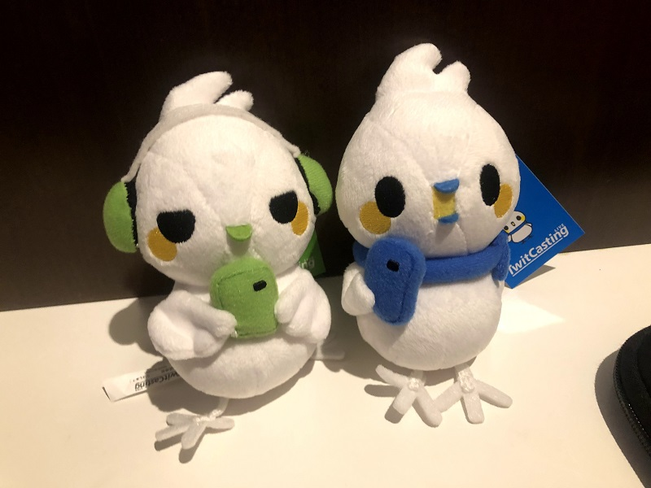
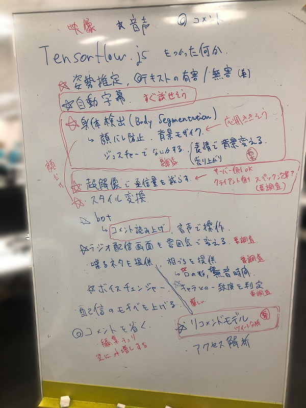

夏休みを振り返る 第2弾です。
ツイキャスサマーインターン2019に参加しました。  
https://twitcasting.tv/internship2019.php

## 応募動機
「B3ならインターンくらい行くよね」という~~Twitter~~天のお告げにより、夏休み中に行けそうなインターン先を探す。
機械学習やってる研究室に配属されたので、そういう系のお仕事に触れてみたかったのもある。

うちの学科は9月頭に学外見学や研修発表といった、夏季休暇の意味について考えさせられる必修科目が存在していたので、そこに被らないインターン先を探してみる。

そんな中、たまたま流れてきたツイキャスインターンのプロモツイートを見る。どうやら応募前チャレンジというのがあって、めちゃくちゃ競プロっぽい。機械学習もできるみたいだし面白そうでは？

## 応募前チャレンジと面接
現在は非公開、というか登録しないと見れないタイプの問題だったので具体的な問題文に言及することは控えますが、競プロっぽい問題(難易度的にはAtCoder Beginner ContestのD問題くらいで、DFS+文字列パースする)の入出力をHTTPリクエストによってやる感じ。入力をGETで得て、それに対する解答を所定のAPIにPOSTする。正しい解答であれば応募に必要な情報がレスポンスとして返ってくる。

さすがに青コーダーなので解法は秒殺だったけど、HTTPリクエストを投げたりPythonで再帰関数を書いたりするのに少し苦戦。なんだかんだ2時間くらい取り組んで、応募した。

少ししてから、面接に関するメールがきた。日程を合わせてビデオ通話で行った(こういうタイプの面接は初めてで、緊張した)。

<blockquote class="twitter-tweet">
イの面接で「コミケとか出てるんですね」って言われて爆笑してしまった
&mdash; 碧黴(あおかび)🦇4日目西O42a (@AokabiC) <a href="https://twitter.com/AokabiC/status/1153238010353180673?ref_src=twsrc%5Etfw">July 22, 2019</a></blockquote> 

ﾋｴｯ

## 通過後～初日
通過の連絡が来て、2週間東京ホテルぐらし！が確定する。コミケの原稿を倒してからはJSの勉強したりWebの本読み漁ってたりしてた(機械学習は？)。  
直前にノートPCが壊れて、前日に銀座AppleストアでMacbook Airを買った。

初日は簡単な自己紹介と、ツイキャスのAPIを使って1dayハッカソン。Flask + Vue.jsで人気キャスランキングみたいなのを作った気がする。  
配信の盛り上がっているポイントを二本探索っぽくサーチしてハイライトを作っている人がいてびっくり。

あとノベルティを色々もらった。

## チーム開発
3人ずつ2つのチームに分かれる。新UI開発をやるチームに回って、アイデア出し。データを使ってモデルを学習させるというよりは、機械学習API等を活用して面白い、便利な機能を作る方針に。

実現可能かどうかは置いといていろいろ出た。個人的には超解像で通信量を削減する、みたいなアイデアは超ロマンあると思ったんだけど、動画のリアルタイム適用は間に合わない。

結局採用されたのは以下。
- 身体検出をして被写体の背景にモザイクをかける
- 表情に応じて画面に色調補正をかける
- コメントしたユーザーの視聴傾向から、視聴者の好みの配信のタグを提示する

上2つはフロントでできるらしくびっくり(TensorFlow.js)。APIをこねくりまわしてコメントユーザーの履歴からタグを引っ張り出す。

### どうやって分析するのか
とにかくタグを集めまくる。そして、形態素解析してDoc2Vecと呼ばれる手法を用いてタグの表記ゆれとかを吸収する([参考](https://www.slideshare.net/TomofumiYoshida2/distributed-representations-of-sentences-and-documents-70011001))。  
例えば「初見さん歓迎」「初見さん大歓迎！」みたいな助詞、感嘆符の揺れをなくす。  
最終発表時に指摘されて気づいたが、実際はこういうタグよりは「ユーザーの興味」が重要であるので、Word2Vec等でタグに頻出する単語を抽出したほうが有益だったと思う(例えば特定のゲームの名前とか)。  
あとはツイキャス文化特有の単語(配信者名など)はやはり学習させないと厳しい。

最終的には、UI上で視聴者が興味のありそうなタグが上位に並んで表示されるようになった。人気配信者だとタグがバンバン並んでいったり、突然上位にくるタグがあったりして興味深かった。

### 競プロは役にたったのか
まあまあ。サーバーサイドだったこともあるが、計算量をざっくり見積もるときや適当なデータ構造を選択する上では役に立った。  
当然だが、これだけでは足りない。Web系の知識やGitHubの使い方は競プロでは養えない(Network Graphをめちゃくちゃにして、すいません)。  

## まとめ
なんだかんだ2週間で形にできて感動(ここで紹介できないのは残念だけど)。コードレビューとかをやったりしたのは初めてだったので新鮮だった。  
あと、11時出勤は神。ちゃんとフレックスで働ける会社を選ぼう。

<blockquote class="twitter-tweet">
モイ株式会社での2週間インターンを終えました <a href="https://t.co/LGQ2z48tmY">pic.twitter.com/LGQ2z48tmY</a>
&mdash; 碧黴(あおかび)🦇4日目西O42a (@AokabiC) <a href="https://twitter.com/AokabiC/status/1167384224430641152?ref_src=twsrc%5Etfw">August 30, 2019</a></blockquote> 

## おまけ
大学の先輩でPFNの社員である五十嵐さん([@kemonot](https://twitter.com/kemonot))を食事にお誘いしたら、なんと秋葉さん([@iwiwi](https://twitter.com/iwiwi))も来ていただけることに。ヤバ。

<blockquote class="twitter-tweet">
PFNの秋葉さん(<a href="https://twitter.com/iwiwi?ref_src=twsrc%5Etfw">@iwiwi</a>)と五十嵐さん(<a href="https://twitter.com/bonprosoft?ref_src=twsrc%5Etfw">@bonprosoft</a> )とご飯に行ってきました(!) 写真は野菜を取り分ける秋葉さんの手です <a href="https://t.co/7iCoya5lHC">pic.twitter.com/7iCoya5lHC</a>
&mdash; 碧黴(あおかび)🦇4日目西O42a (@AokabiC) <a href="https://twitter.com/AokabiC/status/1166351513402236928?ref_src=twsrc%5Etfw">August 27, 2019</a></blockquote> 

銀髪本にサインをすることに。手プルップルになった。
