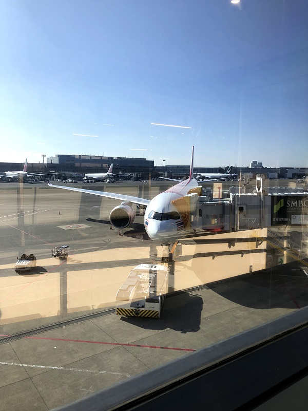
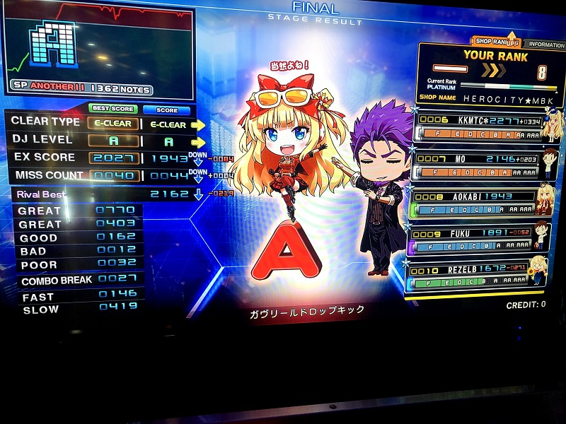
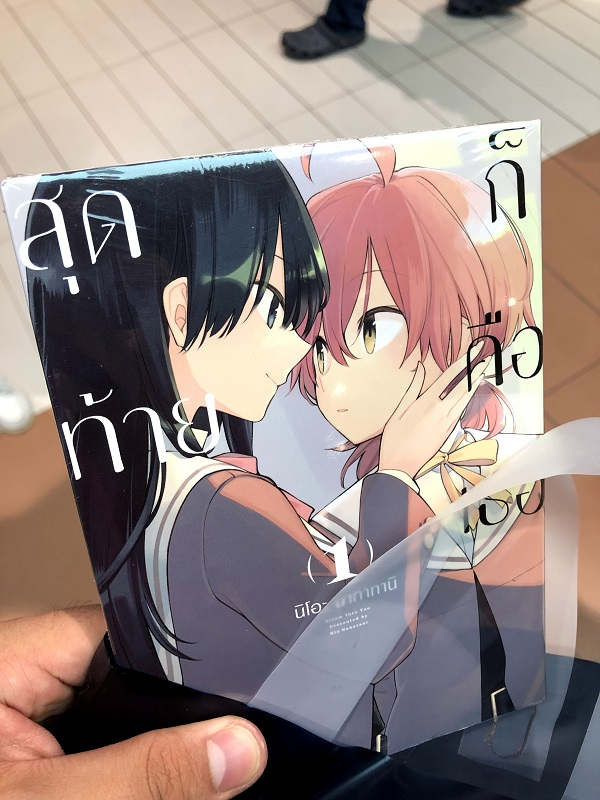
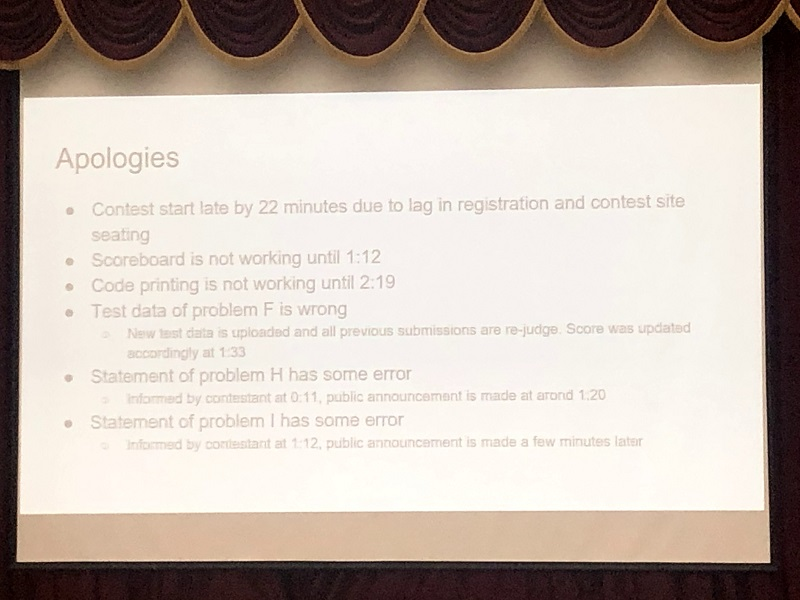
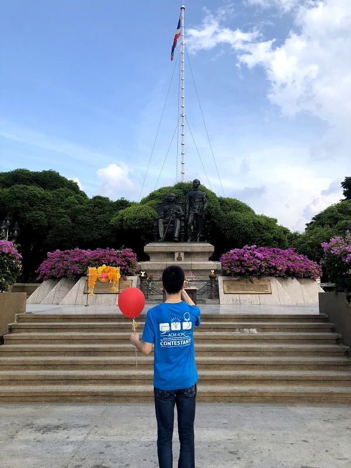
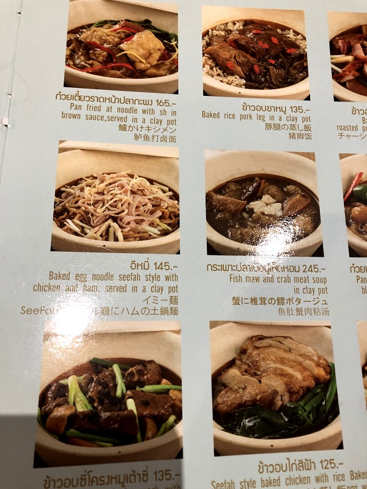

11/2-3 にタイ・バンコクにて開催されました ICPC Asia Bangkok Regional に Aobayama_dropout のメンバー(kotatsugame, Yukly, AokabiC)として参加しました。

## コンテスト前日〜リハーサルセッション
新幹線と飛行機で12時間ほどかけて移動。バカなのでハロウィン絵を朝まで描いていた結果、移動中に実験レポートを書き上げる愚行に出た。  
手荷物預け入れのことをなにも考えずにチケットを手配したので追加料金がそこそこかかる。

現地時間20時ごろにタイのドンムアン空港に到着。霧っぽくて蒸し暑かった。その後、現地のスタッフの方と、同大会に参加するため移動していた東京大学Girigiriの方々と合流し、会場となるチュラーロンコーン大学まで送ってもらう。  
英語や治安に若干の不安はあったものの、なんとかなりそう？ とりあえずタクシーを捕まえてホテルで休みたい。

**ぼったくられた**。

<blockquote class="twitter-tweet">
流れるように5倍の値段でぼったくられて、一同、涙が止まらない……
&mdash; こたつがめ (@kotatsugame_t) <a href="https://twitter.com/kotatsugame_t/status/1190273843425734656?ref_src=twsrc%5Etfw">November 1, 2019</a></blockquote> 

彼は帰国するまでこのことを引きずっていて、300バーツ=1タクシーという単位を使っていた。  
ちなみに**ホテル1泊3タクシー**。は？

あとコンビニで買ったオレンジジュースが妙に甘かったりしてやばかった。果汁20%残り全部砂糖みたいな味。

## 1日目

<blockquote class="twitter-tweet">
<a href="https://t.co/UGMUWdJdVG">pic.twitter.com/UGMUWdJdVG</a>
&mdash; 碧黴(あおかび)🦇4日目西O42a (@AokabiC) <a href="https://twitter.com/AokabiC/status/1190473425350840321?ref_src=twsrc%5Etfw">November 2, 2019</a></blockquote> 

1日目はオープニングセレモニーとプラクティス。各国のチーム紹介やホスト校の紹介ののち、プラクティスのため別室に移動。  
基本的な提出の流れや画面のレイアウト等を確認し、その日は解散。  
どうやら部屋によって机の広さが違うらしい。わくわくか？  

弊チームは全員英語力がゴミカスだったが、現地のスタッフの学生が親切に応対してくれた(若干憐れむ目をしていたけど)。その後は現地の日本語話者の学生が案内役のボランティアとしてついてくださることになり、周辺の商業施設を案内してもらう。タイは親日国であり、日本の系列レストランや書店(紀伊國屋)、ゲームセンターが並んでいたのが印象的だった。

これは……ｺﾞｸﾘ

今度は何事もなくホテルへ戻れた。

## 2日目

#### コンテスト

コンテスト本番当日、開始30分前に集合。開場を待つが、10分前になっても開かない……(200人くらい待機)  

20分ほど遅れてコンテストが開始。前日のプラクティスで確認した通り、問題順が難易度によらず完全ランダム、加えて順位表もシャッフルされるため、全員で一通り問題文を確認。あれ**Dashboardにアクセスできませんが**？？？

わたわたしている間にこたつがめがAを思いつく。えーこれ結構辛そうじゃない？  
AC。なんとA問題のFAだった。すばらしい。

ここで順位表が見られるようになる。**randomized**されてませんが？？？

問題読みを進める。Fはコストが積になる最短路問題。Dを通したこたつがめに説明したらlog取って投げた。ジャッジが壊れていて無限チームがWAを生やしていたが、程なくリジャッジがかかってAC。

Bは構築。実験を進める間にゆきのんからIの概要が飛んでくる。この前beetさんがつぶやいてた 1,2,3,… の区間加算セグ木っぽいやり方でできそう。こたつがめがKを通していた。  
このあたりで確かMがラグランジュ補間っぽいという話になる。ライブラリを持っている人はいますか？**しーん。**さようなら。  
とりあえずIが解けそうなので概要と方針を伝えると、式変形して書いてAC。つおい。  
Bは考察を進めるとグレイコードっぽい遷移をするということになる。ゆきのんがグレイコードの生成を思い出して通る。

あとはわからんかった。結局ABDFIKの6完。ラグランジュ補間は、夏にチームで参加したJAG夏合宿で出たのに解けなかったのはかなり辛かった。  
ただ7完できていたとしてもそこまで上位に食い込めていたわけではないのでなんとも(レベル高くない？)。

#### 閉会式

問題以外のすべてがガバガバコンテスト。弊チームは最後までDashboardを見ることができなかった。  
19/63 位。

#### その後
ガイドの方と食事や観光をして空港へ向かう。Girigiriはもう何泊かしてバンコクを満喫するらしい。

怪レい日本语発見。

空港からAGCに出る。なぜか日本時間00:00開始だったので時差+2時間だけ得をする(タイの現地時間だと22:00開始)。
Bのコーナーがやばかったが冷えずに済んだ。でもエコノミークラスでは安眠は保証されない。