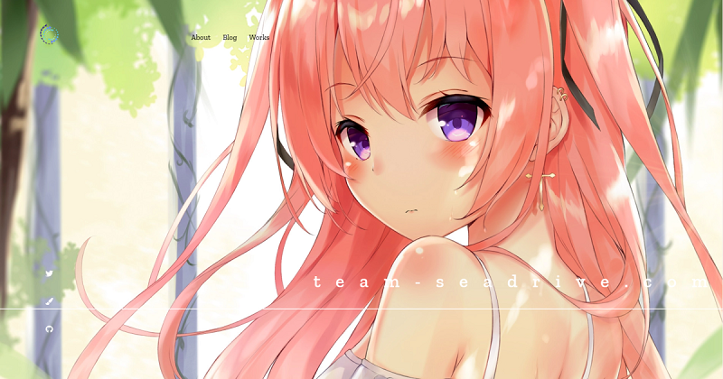
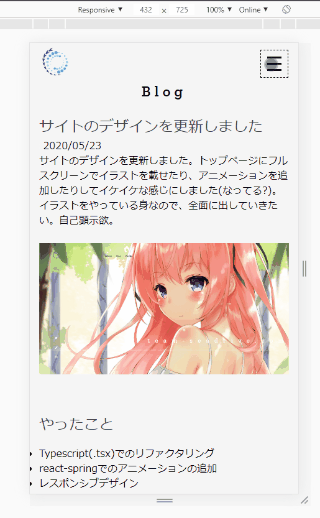
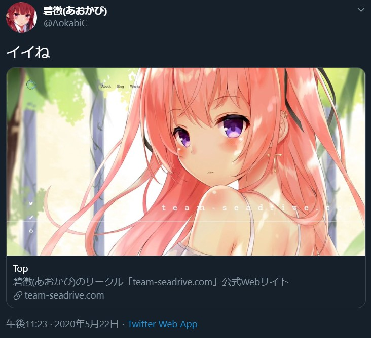

サイトのデザインを更新しました。トップページにフルスクリーンでイラストを載せたり、アニメーションを追加したりしてイケイケな感じにしました(なってる?)。  
イラストをやっている身なので、全面に出していきたい。自己顕示欲。

## やったこと
+ Typescript(.tsx)でのリファクタリング
+ react-springでのアニメーションの追加
+ レスポンシブデザイン  
+ SEO対策(Twitter Cardの追加)

### Typescript(.tsx)でのリファクタリング
Reactを学びたての頃にコピペとかも駆使して作っていたので、コードが結構めちゃくちゃでした。そこからまあまあ勉強したので、手直しした部分はすべてFunctional Componentで書き直しました。

型できちんと縛れていない部分がまだ結構ありますが、そこは追々修正していくことにします。

### react-springでのアニメーションの追加
[react-spring](https://www.react-spring.io/)というモジュールを用いて、サイトにアニメーションを追加しました。トップページでスクロールすると色が変わったり、メニューバーが横に来たり、カードが浮き上がったりしてくるようになっていますが、全てreact-springのHooksを用いています。ちょいちょい型定義にバグがあったり、useTransitionが壊れていたりする気がしますが……。  

ちなみに、スクロールすると発火するアニメーションは[Intersection Observer](https://developer.mozilla.org/ja/docs/Web/API/Intersection_Observer_API)を用いています。独自Hooksで書き出すとRefを与えるだけでviewportとどの程度交差しているか返ってくるので楽ちん。  

もうひとつ、サイドメニューのSNSアイコンのホバーアニメーション(円が描かれるやつ)はSVGを使っています。初めて使いましたが、うまくやるとアニメーションの幅が広がりそうです。その前にイラレの勉強しないと……。

### レスポンシブデザイン

モバイルのレイアウトをちゃんと組みました。ハンバーガーメニューやボタンも自前実装です。ボタンのアニメーションもいい感じ。

レイアウトにはすべてCSS Gridを使おうと思っていたのですが、1列の縦長Gridを作ったらなぜか崩壊したので、モバイルだけFlexBoxを使いました。この2つでたいていどうにかなる感じがします。

## SEO対策
Twitter Cardを実装しました。

SPAだとJavascript実行なしでmetaタグを埋め込むのに若干苦戦しますが、GatsbyJSだとテンプレートに既にSEO.jsという専用のコンポーネントが用意されています。やっていることとしてはReact-Helmetでheadを書き換えているのですが、専用のpluginを使うことでbuild時に埋め込んでくれます。  
[github.com/AokabiC/team-seadrive.com_v2/blob/master...](https://github.com/AokabiC/team-seadrive.com_v2/blob/master/src/utils/seo.tsx)

## ハマったこと
静的サイトジェネレータの仕組みをなんとなくでしか理解していなかったので、react-responsiveでレイアウトごとにコンポーネントをJavascriptで切り替えようとしたらbuild結果に反映されませんでした。build時にモバイルレイアウトのコンポーネントは描画されないので、それを表示させようとするとぶっ壊れます。(development modeだと実行されてしまうので気づかない)  
おとなしくCSS mediaqueryで切り替えましょう。いま考えると当然ですね(静的とは……)。

## 今後やりたいこと
SNSのシェアボタンは早めにつけたいですね。あとは今まで描いた同人誌や自分のスキルのページも作ろうかと思います。  
こういう機能拡張の予定はGitHubのissueにメモっておこう。