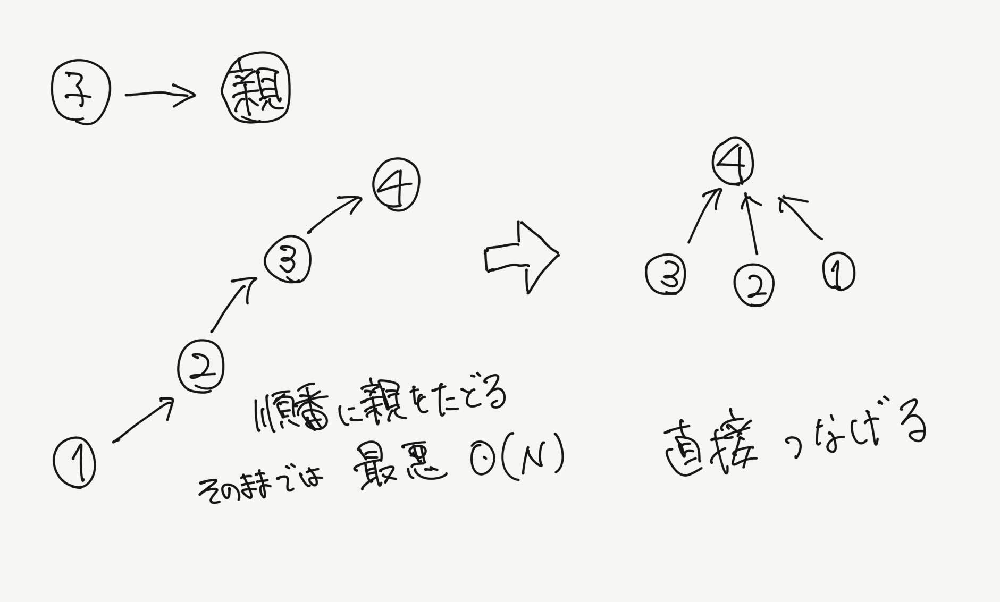

技術書典7で頒布した「銀髪赤眼の後輩と学ぶ競技プログラミング2」のサポートページです。

[誤植](/compro_with_arisa2/#誤植) / [1章](/compro_with_arisa2/#1章) / [2章](/compro_with_arisa2/#2章) / [3章](/compro_with_arisa2/#3章)

## 誤植
|ページ|誤|正|備考|
|---|---|---|---|
|p.10 解法22行目 | floor(H/a_max) : H/max以上の最大の整数 | ans += ceil(H/a_max) : H/max以上の最大の整数 |3/6追記|
|p.15 解法28行目 | floor(less/(1問あたりの点数)) | ceil(less/(1問あたりの点数)) |3/6追記|
|p.16 解法15行目 | (less-1)/(100*(i+1))+1 | (less+100\*(i+1)-1)/(100*(i+1))|どちらもceil()です。|
|p.19 解法2行目 | const LL INF = 1e12; | const LL INF = 1e10; |3/6追記|
|p.29 注釈7 | C++では整数型どうしの割り算はこれに... | C++では整数型どうしの**正の**割り算はこれに... | 小数部分が切り捨てられる。 |
|p.31 modの性質 | a≡b, c≡d | a≡c, b≡d |3/6追記|
|p.32|この計算、ans の値は最大で1e9+8 になります|この計算途中の ans の値は最大で1e9+6 になります||
|p.44 写像12相 | 箱、玉ともに区別する場合、nPr = n!/(n-r)!通り | rPn = r!/(r-n)!通り |3/6追記|
|p.44 写像12相 | 箱は区別し、玉を区別しない場合、nCr = n!/r!(n-r)!通り | rCn = r!/n!(r-n)!通り |3/6追記|
|p.44 写像12相 | ただし、n<kならば0通り。 | ただし、n>rならば0通り。 |3/6追記|
|p.44 | 玉の並べ方違いのr!パターンをn!/(n-r)!から除く | 玉の並べ方違いのn!パターンをr!/(r-n)!から除く |3/6追記|
|p.45 注釈11 | r → r-i | **i** → r-i | |
|p.53|dp[i][j]=max(dp[i-1]][j]+(j以外の活動の幸福度)) | dp[i][k]=max(dp[i-1]][j]+(j以外の活動**k**の幸福度)) |

p.23 図(本文と対応するようにしました)


## 1章
[Otoshidama](https://atcoder.jp/contests/abc085/submissions/7580918)

[Katana Thrower](https://atcoder.jp/contests/abc085/submissions/7581030)

[Synthetic Kadomatsu](https://atcoder.jp/contests/abc119/submissions/7344288)

```cpp:title=DFS
void dfs(int now(探索中の頂点番号)){
    for(int i=0; i<(now から伸びている辺の数); i++){
        next = (次に探索する頂点番号);
        if(nextをまだ探索していなければ) dfs(next);
    }
}
```

All Green -
[bit全探索解](https://atcoder.jp/contests/abc104/submissions/7581080) / [next_permutation解](https://atcoder.jp/contests/abc104/submissions/7704885)


```cpp:title=二分探索
int binary_search(int ok, int ng){
    while (abs(ok - ng) > 1) {
        int mid = (ok + ng) / 2;
        if(f(mid)) ok = mid;
        else ng = mid;
    }
    return ok;
}
```

[Widespread](https://atcoder.jp/contests/arc075/submissions/7439117)

```cpp:title=Union-Find
struct UnionFind {
    vector<int> data;
    UnionFind(int size) : data(size, -1) { }

    // 集合をマージする
    // すでに同じ集合ならfalseが返る
    bool merge(int x, int y) {
        x = root(x); y = root(y);
        if (x == y) return false;
        // 要素数の少ない方を多い方に繋げる
        if (data[y] < data[x]) swap(x, y);
        data[x] += data[y];
        data[y] = x;
        return true;
    }

    // ある要素がどの集合に属しているかを答える
    int root(int x) {
        // 根に直接つなぎ直す
        return data[x]<0 ? x : (data[x]=root(data[x]));
    }

    // ある集合の大きさを答える
    int size(int x) {
        return -data[root(x)];
    }
};
```

[Decayed Bridges](https://atcoder.jp/contests/abc120/submissions/7581485)

[Tips - つるかめ算](https://atcoder.jp/contests/abc085/submissions/7325293)

## 2章

素数、コンテスト、素数 - [試し割り法解](https://atcoder.jp/contests/arc017/submissions/7454758) / [エラトステネスの篩解](https://atcoder.jp/contests/arc017/submissions/7455097)

```cpp:title=GCD
LL gcd(LL a, LL b) {
    if(b == 0) return a;
    else return gcd(b, a%b);
}
```

[Anti-Division](https://atcoder.jp/contests/abc131/submissions/7456487)

[Remainder Minimization 2019](https://atcoder.jp/contests/abc133/submissions/7463278)

[Training Camp](https://atcoder.jp/contests/abc055/submissions/7464695)

```cpp:title=拡張ユークリッドの互除法
LL extgcd(LL a, LL b, LL &x, LL &y) {
    if (b == 0) {
        x = 1;
        y = 0;
        return a;
    }
    LL g = extgcd(b, a % b, x, y);
    LL nextx = y, nexty = x-(a/b)*y;
    x = nextx; y = nexty;
    return g;
}

int main(){
    LL a, p;
    cin >> a >> p;
    LL x, y;
    LL g = extgcd(a, p, x, y);
    while(x < 0) x += p;
    x %= p;
    cout << x << endl;
}
```

いろはちゃんとマス目 - [拡張ユークリッドの互除法解](https://atcoder.jp/contests/abc042/submissions/7482116) / [フェルマーの小定理解](https://atcoder.jp/contests/abc042/submissions/7482725) / [modint](https://atcoder.jp/contests/abc042/submissions/7482885)

```cpp:title=modint構造体
template<int mod>
struct ModInt {
    int x;

    ModInt() : x(0) {}
    ModInt(long long y) : x( y>=0 ? y%mod : (mod - (-y)%mod) % mod ) {}


    ModInt &operator+=(const ModInt &p) {
        if((x += p.x) >= mod) x -= mod;
        return *this;
    }
    ModInt &operator-=(const ModInt &p) {
        if((x += mod - p.x) >= mod) x -= mod;
        return *this;
    }
    ModInt &operator*=(const ModInt &p) {
        x = (int)(1LL * x * p.x % mod);
        return *this;
    }
    ModInt &operator/=(const ModInt &p) {
        *this *= p.inverse();
        return *this;
    }

    ModInt operator-() const { return ModInt(-x); }
    ModInt operator+(const ModInt &p) const { return ModInt(*this) += p; }
    ModInt operator-(const ModInt &p) const { return ModInt(*this) -= p; }
    ModInt operator*(const ModInt &p) const { return ModInt(*this) *= p; }
    ModInt operator/(const ModInt &p) const { return ModInt(*this) /= p; }

    bool operator==(const ModInt &p) const { return x == p.x; }
    bool operator!=(const ModInt &p) const { return x != p.x; }

    ModInt inverse() const {
        int a = x, b = mod, u = 1, v = 0, t;
        while(b > 0) {
            t = a/b;
            a -= t*b;
            swap(a, b);
            u -= t*v;
            swap(u, v);
        }
        return ModInt(u);
    }

    ModInt pow(int e) const {
        long long a = 1, p = x;
        while(e > 0) {
            if(e%2 == 0) {p = (p*p) % mod; e /= 2;}
            else {a = (a*p) % mod; e--;}
        }
        return ModInt(a);
    }
};
```

> 補足  
> modint型の数値 `a` をcoutするには `a.x`とするか、ostream型演算子<<をオーバーロードします。
```cpp
    friend ostream &operator<<(ostream &os, const ModInt<mod> &p) {
        return os << p.x;
    }
    friend istream &operator>>(istream &is, ModInt<mod> &a) {
        long long x;
        is >> x;
        a = ModInt<mod>(x);
        return (is);
    }
```

## 3章

```cpp:title=スターリング数
const int mod = 1e9 + 7;
using modint = ModInt<mod>;

modint S[1010][1010];

int main(){
    int N, r;
    cin >> N >> r;
    for(int i=1; i<=N; i++){
        S[i][1] = 1;
        S[i][i] = 1;
    }
    for(int i=2; i<=N; i++){
        for(int j=2; j<=r; j++){
            S[i][j] = S[i-1][j-1] + S[i-1][j] * j;
        }
    }

    for(int i=1; i<=N; i++){
        for(int j=1; j<=r; j++){
            cout << S[i][j] << " ";
        }
        cout << endl;
    }
    // 求める解はS[N][r]
}
```

[Frog 1](https://atcoder.jp/contests/dp/submissions/7567670)

[Vacation](https://atcoder.jp/contests/dp/submissions/7569025)

[Knapsack 1](https://atcoder.jp/contests/dp/submissions/7569794)

[Knapsack 2](https://atcoder.jp/contests/dp/submissions/7570315)

[LCS](https://atcoder.jp/contests/dp/submissions/7570930)

[Matching](https://atcoder.jp/contests/dp/submissions/7580773)