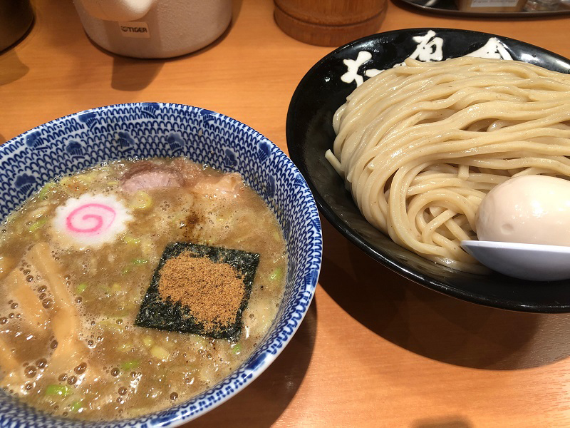

夏休みを振り返る 第3弾です。
9/14-16に行われたACM-ICPC OB・OGの会(JAG)主催の強化夏合宿にAobayama_dropoutのメンバーとして参加しました。

## 1日目

技術書典7の新刊の原稿が終わってなくてやべえ!! 深夜まで作業をやっていた結果若干寝坊。こたつがめにみどりの窓口に並んでおいてもらって切符をGET。なんとか乗車。  
JAGの合宿は2年目。去年はオンサイト初めてだったが、この1年でたくさんイベントに参加したので今年は知り合いが多い。自己紹介で自分の同人誌の宣伝をしたりした。

### コンテスト
https://onlinejudge.u-aizu.ac.jp/services/room.html#JAGSummerCamp19Day1

今年は1日目に5時間セットが降ってきてひっくり返る。いつもの通りぼくがA問題を読む。簡単なアドホックですがコーナーに殺されました(1WA)。AGC-Aっぽかったかも。

B、Cをそれぞれゆきのん、こたつがめが解いて1時間くらい。Dをこたつがめが実装している間にEを読む。ゆきのんがシミュレートして正当性を検証する解をあげるが、制約で爆発。

ぼく「これアイテムの価値が$10^{10^5}$とかにならない？」  
ゆきのん「うーん、多倍長整数！ｗ」  
ぼく「は？」  

あーだこーだ話しているとmodを取れば大丈夫そうという話になる。実装を見守る。  
割り算で逆元を取っていなかったりすることを指摘して投げる。WA！なんでぇ～ こたつがめもDが通らずつらそう。

ここで順位表を見るとJが通っているっぽい。実験をやるとx,y座標ともに共有しない集合に分けるみたいな解法が降ってくる。えーどうやんのって言っていたらこたつがめが2部マッチングを使うことを教えてくれた。書いてAC。

Dがオーバーフローで落ちているっぽいと言ってこたつがめがPythonで書き直したら通ってキレていた。かわいそう。

全員でEのバグとりをやる。modの衝突っぽそうなので複数取ってみる。いくら取っても通らない。えー7個取って衝突するとかある?他がバグってそう。  
……と思っていたらなんと`||`と`&&`を間違えていたことが判明。あ   ほ   く   さ

結果ABCDEJの6完。

### 夜
部屋はpazzleさん、ぴーよさん、Senさんと一緒だった。  
原稿ちょっとやって布団に刺さってた気がする。懇親を捨てた男。

## 2日目
### 朝
朝食に行くかと同室のみんなと話をする。歯を磨いて部屋に戻ったら誰もいなくなっていてひっくり返った(2回目)。

<blockquote class="twitter-tweet">
なんか顔洗って部屋戻ったら人々消滅してて一人で食堂に向かっている
&mdash; 碧黴(あおかび)🦇4日目西O42a (@AokabiC) <a href="https://twitter.com/AokabiC/status/1173014728379002880?ref_src=twsrc%5Etfw">September 14, 2019</a></blockquote> 

先に行ったと思われていたらしい。すまん。

### コンテスト

https://onlinejudge.u-aizu.ac.jp/services/room.html#JAGSummerCamp19Day2/ranking

問題難易度全シャッフルは初めてで戸惑う。しょうがないので流し読みしていると、Dがビット全探索っぽいので考察をすすめる。  
Eをこたつがめが通した後に書くとTLEる。怪しいところを直してもらってAC。

Aが通り、他を読むが難しい。Iの実装と提出を見守っているとWA。つらそう。  
Jの考察をゆきのんと進めると、$O(S)$で計算できる式($1$から$S$までの$n$乗交代和)が生えるが、$S \leq 10^9$なので終了。オーダーを落とせなかった。

Iのほうはジャッジが間違っていたらしく通っていた。ADEIの4完。

Jはベルヌーイ数というものを使ったり、ラグランジュ補間によって計算できるらしい。うーむ。

### 夜
ABCに出る。 

<blockquote class="twitter-tweet">
全完すれば入れますよ
&mdash; TAB (@_____TAB_____) <a href="https://twitter.com/_____TAB_____/status/1173151808316829697?ref_src=twsrc%5Etfw">September 15, 2019</a></blockquote> 

Eの文字列問題が解けず冷え散らかす。線形アルゴリズムをいじる着想がでて解けないのは本当にダメ。  
原稿やって寝る。

## 3日目
### 朝

<blockquote class="twitter-tweet">
朝食、nullしか置いてなくて泣いちゃった
&mdash; 碧黴(あおかび)🦇4日目西O42a (@AokabiC) <a href="https://twitter.com/AokabiC/status/1173382399691878400?ref_src=twsrc%5Etfw">September 15, 2019</a></blockquote> 

みんなで朝食に行けたが、nullしか残っておらず涙……。

### コンテスト
4時間北大セット。  
https://onlinejudge.u-aizu.ac.jp/services/room.html#JAGSummerCamp19Day3

A問題を読む。簡単すぎて怪しい、"Arbitrary"という単語の解釈に不安があり、全員に聞くが**全員わからない**。えぇ……  
2WAです。ペナしか生やしてなくてすいません。

B, Cがサクッと通るが、あと解けそうな問題がなくてキツイ。冷え散らかしそうだったが、こたつがめがEのDP遷移を生やして終了8分前に通した。  
早解きが効いて4完最速。ここまでなにもできなかったのは久々でつらい。

### 終了後
自分の進捗がやばかったこともあってまっすぐ東京駅に向かった。ゲーセンはまた今度……(JSCでやりました)

東京駅・六厘舎。うまかった。

<blockquote class="twitter-tweet">
[こたつがめがコンテスト中に詠唱したもの一覧] ・スーモ ・ゆうさく ・だいちくん ・水素の音 ・変態糞土方 ・「邪淫」について
&mdash; 碧黴(あおかび)🦇4日目西O42a (@AokabiC) <a href="https://twitter.com/AokabiC/status/1173474644155756545?ref_src=twsrc%5Etfw">September 16, 2019</a></blockquote> 

なにこれ?

