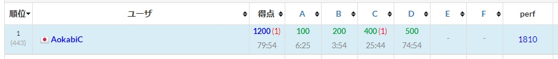
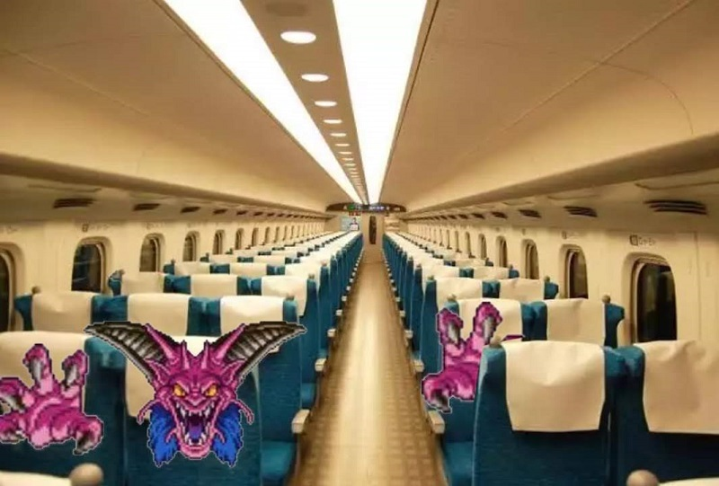
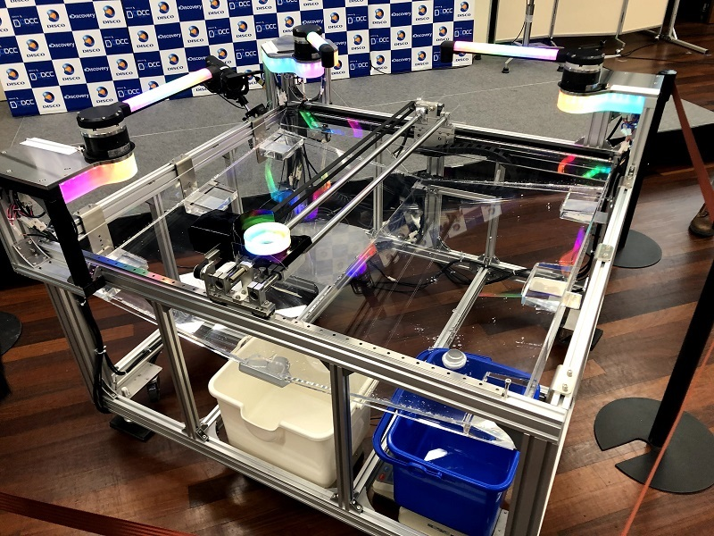
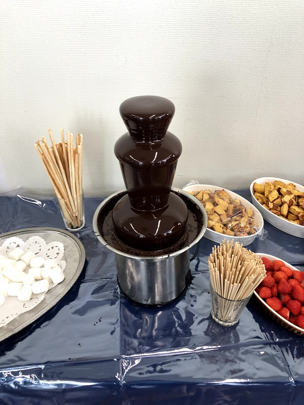

DISCO Presents ディスカバリーチャンネルコードコンテスト2020 本戦に参加しました。

## 予選

4完445位。Eのインタラクティブはもうちょい時間があれば解けてたかもなぁ。  
21卒なので枠が降ってくる。サイコー！200人枠のうち100人も枠があればね、さすがに

## 本戦
朝4時起床。なんで?  
始発のはやぶさで行かないと間に合わないので、こたつがめと一緒に行く。指定席が連席どころか前後ですら残っていなくて東京駅で合流することに。

大森駅から歩いていると、信号待ち中のbeetさんに会う。会津大は前泊費用が支給されていたらしくキレ散らかした。まあユークリッド距離じゃなくて時間距離のはなしなので……。

<blockquote class="twitter-tweet">
<a href="https://twitter.com/hashtag/DDCC2020?src=hash&amp;ref_src=twsrc%5Etfw">#DDCC2020</a> いくぜ！ <a href="https://t.co/Mn6fGK0sEz">pic.twitter.com/Mn6fGK0sEz</a>
&mdash; 碧黴(あおかび)🦇 (@AokabiC) <a href="https://twitter.com/AokabiC/status/1220861813278965760?ref_src=twsrc%5Etfw">January 25, 2020</a></blockquote> 

<blockquote class="twitter-tweet">
<a href="https://t.co/3rSw17HoHi">pic.twitter.com/3rSw17HoHi</a>
&mdash; 卒論に内容はいらない！ (@kyort0n) <a href="https://twitter.com/kyort0n/status/1220865377606881280?ref_src=twsrc%5Etfw">January 25, 2020</a></blockquote> 

橙2人(beetさんとこるとんさん)に挟まれる形で座る。ひえ～

## コード部門本戦

90分というかなり短いコンテスト。同一IP制限で全員がAtCoderに入れなかったり、配点が3分前くらいまで公開されていなかったりしてワタワタしていた。  
[https://atcoder.jp/contests/ddcc2020-final](https://atcoder.jp/contests/ddcc2020-final)

A問題は見た目そのままNimをやる。素因数分解のスニペットをちゃんと用意していなくて書いたら若干ハマったけど、10分くらいで通る。

B問題とC問題のsubmitが出ていたが、なんとなくとっつけそうなBをやる。
Kが大きいときに適当な閉路でループするはず、そして回数を稼ぐためにループする閉路はたかだか1つだと思ったので、(1)ループに入る前(2)ループ(3)ループ抜けた後でそれぞれDPをやれば良さそう? と思って書く。ただ、0とのmaxをとる制約をどうやっても潰せる気がしなくて敗北。

想定解は行列累乗らしい。トロピカル半群、知らず―――  
134位。

## 装置実装部門

会場真ん中に置かれていたゲーミングPCみたいな光り方をしていた装置はこれに使うやつ。

60分でマラソン形式の問題を解いて、装置を模したシミュレータ上で水を運んだ量をスコア化する。その上位20人がさらに時間をかけてコードを詰め、実際の装置で走らせそのスコアを競う、らしい。  

Contestantじゃないと問題が見えないので概要を軽く説明すると、水を出すノズルが3つと水を入れて運ぶビーカーが存在して、それぞれ指示を与えてノズルの角度を変えたりビーカーを指定した地点に移動させたりする。  
ノズルは(A)自由に動く (B)Aの水を出した量によって決まった角度に変化する (C)固定 の3種類があり、各ノズルは一度使うと別の決まったノズルを使わないと再使用可能にならない。また各ノズルに水の排出スピードがあらかじめ設定されている。そのため、排出スピードによってノズルを巡回する順番をうまく決めるのが本質である問題、だった。

この内容が約3000文字の超分量で記述されており、60分で誤読なく、バグらせずに実装させるのはかなり至難の業だった。結局Aと排出口を往復するコードを書いた後、Bの回転角を計算する部分をバグらせていて92位。正の点数を得たのが全体の半分くらいなのでまあ……。

## ビュッフェ

食事しながら懇親タイム。チョコレートフォンデュが立っていてすごかった。  
い つ も の に加えて、オンサイトではあまり会えない中高生とかと交流。

## 会社紹介・見学ツアー
DISCO社の紹介を受ける。社内ではWillという通貨で労働や"""やりがい"""がやりとりされているらしく若干の闇を感じる。現金のほうが、うれしいだろ

<blockquote class="twitter-tweet">
相手に仕事を押し付けまくってWillを大量発行すればハイパーインフレが起きて社内のエコシステムが崩壊する
&mdash; 碧黴(あおかび)🦇 (@AokabiC) <a href="https://twitter.com/AokabiC/status/1220934055169945601?ref_src=twsrc%5Etfw">January 25, 2020</a></blockquote> 

~~偉い人がスライドを使って喋っている間にこるとんさんが人形で遊び始めていて面白かった。~~

ツアーではNC工作機械や社内の福利厚生施設を見学。屋上にバカデケェプールがあってひっくり返った。

ツアーから帰ってきて決勝の準備のため待機していると、偶然音ゲー関係で知ってる人に出会って両者バカデケェ声出た。名前は伏せてほしいそうなので伏せておくけど、精進量がバケモンで参ってしまった。

## 装置実装部門決勝
決勝では実際に機械を動かして水を運んだ量を競う。慣性によって水が溢れてしまうので、ビーカーの速度の調整も肝になる。  
コードの工夫点が実際にビジュアライズされるのはかなり面白かった。(A)+(C)、(B)を周回するというやり方で、(A)の排出量を調整することで(B)の角度を常に有利に保つ戦法がなるほどなあと思った。

何度か怪しい判定によりリジャッジがかかる場面があったものの、最後に一番多くの水を運んだdividebyzeroさんが優勝を決める。結局誤読、バグなく実装するのが決め手だったみたい。さすがにあの分量だと誤読してしまう……。

## 表彰式と懇親会
DISCOで製造しているウェーハが賞状になっていた。3位の某金冠の方がお散歩をしていて不在、あの伝説が話題になる。

<blockquote class="twitter-tweet">
beetさん人間性伝説 表彰式登壇に呼ばれるもお手洗いにいて不在←new!
&mdash; platypus (@platypus999) <a href="https://twitter.com/platypus999/status/1206108082595479552?ref_src=twsrc%5Etfw">December 15, 2019</a></blockquote> 

終わった後はokimochiの方々やてぃーいけ、ながたかなさんなどの社会人などなど12人くらいの団体で中華料理屋へ。

<blockquote class="twitter-tweet">
飲酒！ <a href="https://t.co/JRQXL3KYZs">pic.twitter.com/JRQXL3KYZs</a>
&mdash; こたつがめ (@kotatsugame_t) <a href="https://twitter.com/kotatsugame_t/status/1221017620918358016?ref_src=twsrc%5Etfw">January 25, 2020</a></blockquote> 

こたつがめがお酒を喜んで飲んでいて、弊でも飲酒コンをやりたいなと思った。