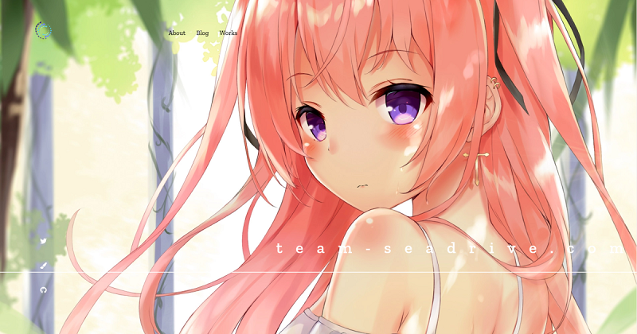
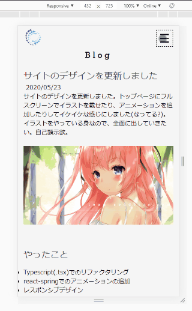
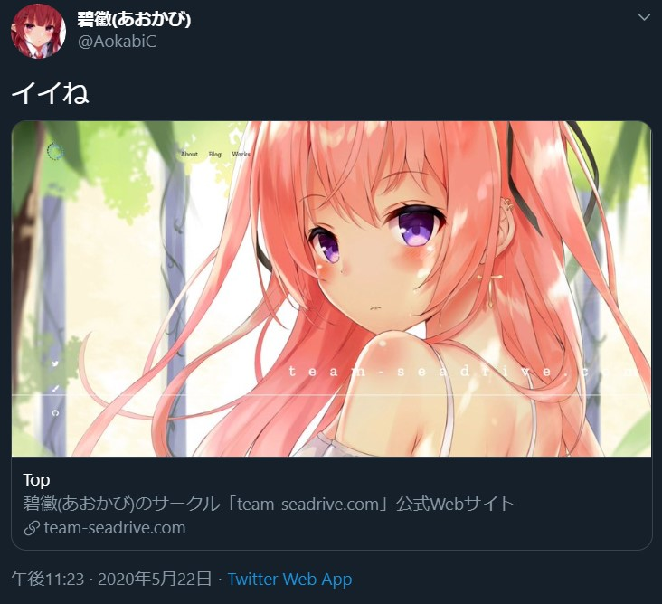

サイトのデザインを更新しました。トップページにフルスクリーンでイラストを載せたり、アニメーションを追加したりしてイケイケな感じにしました(なってる?)。  
イラストをやっている身なので、全面に出していきたい。自己顕示欲。

## やったこと

- Typescript(.tsx)でのリファクタリング
- react-spring でのアニメーションの追加
- レスポンシブデザイン
- SEO 対策(Twitter Card の追加)

### Typescript(.tsx)でのリファクタリング

React を学びたての頃にコピペとかも駆使して作っていたので、コードが結構めちゃくちゃでした。そこからまあまあ勉強したので、手直しした部分はすべて Functional Component で書き直しました。

型できちんと縛れていない部分がまだ結構ありますが、そこは追々修正していくことにします。

### react-spring でのアニメーションの追加

[react-spring](https://www.react-spring.io/)というモジュールを用いて、サイトにアニメーションを追加しました。トップページでスクロールすると色が変わったり、メニューバーが横に来たり、カードが浮き上がったりしてくるようになっていますが、全て react-spring の Hooks を用いています。ちょいちょい型定義にバグがあったり、useTransition が壊れていたりする気がしますが……。

ちなみに、スクロールすると発火するアニメーションは[Intersection Observer](https://developer.mozilla.org/ja/docs/Web/API/Intersection_Observer_API)を用いています。独自 Hooks で書き出すと Ref を与えるだけで viewport とどの程度交差しているか返ってくるので楽ちん。

もうひとつ、サイドメニューの SNS アイコンのホバーアニメーション(円が描かれるやつ)は SVG を使っています。初めて使いましたが、うまくやるとアニメーションの幅が広がりそうです。その前にイラレの勉強しないと……。

### レスポンシブデザイン

モバイルのレイアウトをちゃんと組みました。ハンバーガーメニューやボタンも自前実装です。ボタンのアニメーションもいい感じ。

レイアウトにはすべて CSS Grid を使おうと思っていたのですが、1 列の縦長 Grid を作ったらなぜか崩壊したので、モバイルだけ FlexBox を使いました。この 2 つでたいていどうにかなる感じがします。

## SEO 対策

Twitter Card を実装しました。

SPA だと Javascript 実行なしで meta タグを埋め込むのに若干苦戦しますが、GatsbyJS だとテンプレートに既に SEO.js という専用のコンポーネントが用意されています。やっていることとしては React-Helmet で head を書き換えているのですが、専用の plugin を使うことで build 時に埋め込んでくれます。  
[github.com/AokabiC/team-seadrive.com_v2/blob/master...](https://github.com/AokabiC/team-seadrive.com_v2/blob/master/src/utils/seo.tsx)

## ハマったこと

静的サイトジェネレータの仕組みをなんとなくでしか理解していなかったので、react-responsive でレイアウトごとにコンポーネントを Javascript で切り替えようとしたら build 結果に反映されませんでした。build 時にモバイルレイアウトのコンポーネントは描画されないので、それを表示させようとするとぶっ壊れます。(development mode だと実行されてしまうので気づかない)  
おとなしく CSS mediaquery で切り替えましょう。いま考えると当然ですね(静的とは……)。

## 今後やりたいこと

SNS のシェアボタンは早めにつけたいですね。あとは今まで描いた同人誌や自分のスキルのページも作ろうかと思います。  
こういう機能拡張の予定は GitHub の issue にメモっておこう。
