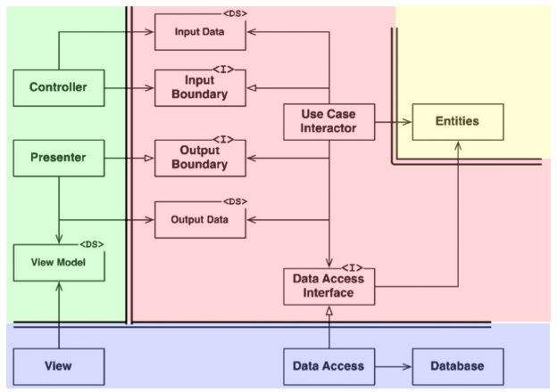

碧黴(あおかび)です。[23卒エンジニア志望学生LT会 vol.2](https://connpass.com/event/215902/)に「趣味ではじめるドメイン駆動設計+クリーンアーキテクチャ」というテーマで登壇しました。

最近チーム開発で Web サービスを作っているのですが、その際に得られた知見をもとに話しています。

- [登壇資料](https://speakerdeck.com/aokabic/qu-wei-dehazimeru-domeinqu-dong-she-ji-plus-kurinakitekutiya)
- [実装例](https://github.com/AokabiC/clean-like-api)
- [YouTube Stream](https://youtu.be/sZW7KCCB8OU)

<SpeakerDeck id="31b6d9476f2447f09e2cb2b442a312ff" />

参考資料:

- [ドメイン駆動設計入門 ボトムアップでわかる！ドメイン駆動設計の基本](https://www.shoeisha.co.jp/book/detail/9784798150727)
  - 実装例が豊富で、とっつきやすく実践的です。主にこちらを参考にしました。
- [実装クリーンアーキテクチャ - Qiita](https://qiita.com/nrslib/items/a5f902c4defc83bd46b8)
- [【プログラミング】実践クリーンアーキテクチャ - YouTube](https://www.youtube.com/watch?v=BvzjpAe3d4g)
- [The Clean Architecture](https://8thlight.com/blog/uncle-bob/2012/08/13/the-clean-architecture.html)
- [The Clean Architecture(翻訳)](https://blog.tai2.net/the_clean_architecture.html)
  - 提唱者の Rovert C. Martin (Bob おじさん)による記事。
- [クリーンアーキテクチャ完全に理解した](https://gist.github.com/mpppk/609d592f25cab9312654b39f1b357c60)
  - Clean Architecture について詳細にまとめられたチートシート。DDD との関連についても述べられています。
- [世界一わかりやすい Clean Architecture](https://www.nuits.jp/entry/easiest-clean-architecture-2019-09)
  - タイトルが強いですが、普遍的・汎用的なアーキテクチャである点で本質の考えについて述べられています。

## クリーンアーキテクチャについての疑問・解釈

## Adapter 層は Infra 層に依存してはいけないんじゃないの？

その通り、Frontend とは REST API でやり取りするから UI は React 製だろうが Vue 製だろうが交換可能ですし、疎結合になるわけです。
しかし実際には、Adapter 層が外界のことを全く知らないというのは不可能なわけです。サーバーは少なくともクライアント側から HTTP 通信でどんなデータがほしいというリクエストが来ることを仮定するわけですから、その点では外界のことをいくらか知っている状態になります。

このあたりの「外界の仮定」の存在そのものを Clean Architecture の矛盾だと標榜している記事もいくらか見受けられます。つまり、Infra 層のことを全く知らずに Adapter 層を記述するのは無理だという話です。  
もとの記事に立ち返ってみましょう(ここでは和訳を引用します)。

> また、このレイヤーには、その他すべてのアダプターもある。それらは、外部の形式(たとえば外部サービス)から、ユースケースとエンティティーで使われる内部形式にデータを変換するために必要なものだ。

Adapter 層は外部、つまり Infra 層から提供される形式のことを知っているのです。Adapter 層は外界とビジネスロジックを接続する変換器という役割で、Infra の形式が変われば変換器も多少は影響を受けると考えるのが自然でしょう。Usecase 層まででロジック自体はカプセル化されているので、Adapter / Infra 層を書き換えることで Framework を(ビジネスロジックに影響を与えずに)交換可能だと考えることもできます。

### Infra 層の存在意義は？

では、Infra 層はなぜ存在するのでしょうか？それは、変換とは関わりのないギークなコードを置く場所として区別するためにあるのでしょう。例えばサーバーの立ち上げや DB のマイグレーションといったコードはビジネスロジックとは一切関係ない、「実装上の都合」です。そういうものは完全に外側に隔離することで責務をより明確にしているのでしょう。

(しかしながら、Infra 層に属するものとして、Web フレームワークやORMが挙げられています。これを考慮すると、Adapter 層ではフレームワークの機能を直接利用せず、Infra 層で書かれた Wrapper を通して利用するのがいいのかもしれません。これは『機能満載のソフトウェアのライブラリが手に入ることには依存しない』というフレームワーク独立を達成するために必要なことですが、逆に考えればフレームワークが Wrap してくれている機能を殺してしまうと考えられるかもしれません。このあたりはトレードオフの関係でしょう。  

Onion Architecture は、Adapter 層と Infra 層との明確な区別がないです。Clean Architecture がそれらのアーキテクチャを単一の概念に無理なく統合する試みと考えると、このあたりの境界に解釈の余地があることも納得がいきます。あくまで「普遍的かつどんなソフトウェアにも適用可能なアーキテクチャ」ですから、このあたりの解釈は結局プロジェクトに委ねられるのだと思います。)
