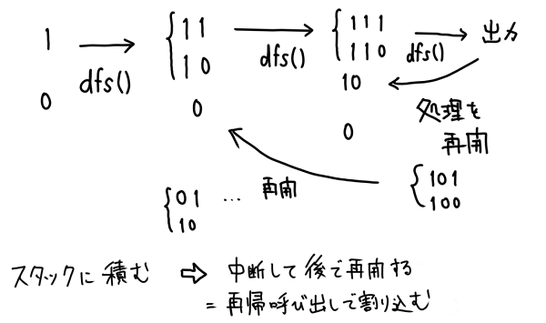

技術書典 6 で頒布した「銀髪赤眼の後輩と学ぶ競技プログラミング」のサポートページです。

2 のサポートページは[こちら](/compro_with_arisa2/)。

[誤植](/compro_with_arisa/#誤植) / [1 章](/compro_with_arisa/#1章) / [2 章](/compro_with_arisa/#2章) / [3 章](/compro_with_arisa/#3章) / [4 章](/compro_with_arisa/#4章)

## 誤植

| ページ | 誤                                      | 正                          | 備考      |
| ------ | --------------------------------------- | --------------------------- | --------- |
| p.28   | 引数 str - pos - 検索を…                | (削除)                      |           |
| p.39   | log(min A_i)回                          | log(max A_i)回              |           |
| p.41   | 型 T は比較演算子 > が定義…             | 型 T は比較演算子 < が定義… | 4/24 追記 |
| p.44   | for(int i=0; i=N; i++){                 | for(int i=0; i<N; i++){     | 4/24 追記 |
| p.50   | (101011 >> 2) -> 101100                 | (101011 << 2) -> 101100     | 6/7 追記  |
| p.53   | コード内 sum += stoll(… の下行          | ans += sum; を追加          |           |
| p.61   | DFS の実装コード 最終行                 | } を追加                    |           |
| p.62   | st.push(data); / st.front(); / st.pop() | st を que に変更            | 6/15 追記 |
| p.67   | void dfs(int now)                       | void dfs(string now)        | 3/6 追記  |

p.57 図(わかりやすく改変しました)


## 1 章

```cpp title=1.2
#include <bits/stdc++.h>
using namespace std;

int main() {
  cout << "こんにちは" << endl;
  cout << "AtCoder" << endl;
}
```

```cpp title=1.3
#include <bits/stdc++.h>
using namespace std;

int main(){
    int a, b;
    cin >> a >> b;
    if((a*b)%2 == 0){
        cout << "Even" << endl;
    }else{
        cout << "Odd" << endl;
    }
}
```

```cpp title=1.5
int main(){
    int N;
    cin >> N;
    vector<int> a(N);
    for(int i=0; i<N; i++){
        cin >> a[i];
    }
    int sum = 0;
    for(int i=0; i<N; i++){
        // sum に a[i] を 足す
        // sum = sum + a[i] と同じ意味
        sum += a[i];
    }
    cout << sum << endl;
}
```

## 2 章

```cpp title=2.2
int main(){
    string A, B, C;
    cin >> A >> B >> C;
    if(A[A.size()-1] == B[0] && B[B.size()-1] == C[0]){
        cout << "YES" << endl;
    }
    else cout << "NO" << endl;
}
```

```cpp title=2.3
int main(){
        string S;
        cin >> S;
        if(S.substr(0, 3) == "yah" && S[3] == S[4]){
                cout << "YES" << endl;
        }
        else cout << "NO" << endl;
}
```

```cpp title=2.6
int main(){
        string N;
        cin >> N;
        int S = 0;
        for(int i=0; i< N.size(); i++){
            S += N[i] - '0';
        }
        if(stoi(N) % S == 0) cout << "Yes" << endl;
        else cout << "No" << endl;
}
```

## 3 章

```cpp title=3.3
int main(){
    int ans = 0;
    bool div_by_2 = true;
    while(div_by_2){
        for(int i=0; i<N; i++){
            if(A[i] % 2 == 1){
                div_by_2 = false;
                break;
            }else{
                A[i] /= 2;
            }
        }
        // すべて2で割り切れる
        if(div_by_2){
            ans++;
        }
    }
    cout << ans << endl;
}
```

```cpp title=3.4
int main(){
    int A, B, C, X;
    cin >> A >> B >> C >> X;
    int ans = 0;
    for(int a = 0; a <= A; ++a) {
        for(int b = 0; b <= B; ++b) {
            for(int c = 0; c <= C; ++c) {
                // 合計
                int total = 500*a + 100*b + 50*c;
                if(total == X) ans++;
            }
        }
    }
    cout << res << endl;
}
```

```cpp title=3.6
int main() {
    int N, K;
    cin >> N >> K;
    vector<int> l(N);
    for(int i=0; i<N; i++) cin >> l[i];

    sort(l.begin(), l.end());
    reverse(l.begin(), l.end());
    int ans = 0;
    for(int i=0; i<K; i++) ans += l[i];
    cout << ans << endl;
}
```

```cpp title=3.7
const int INF = 999999999;
int main() {
    int N;
    cin >> N;
    string S;
    cin >> S;
    vector<int> vW(N+1, 0), vE(N+1, 0);
    for(int i=0; i<N; i++){
        vW[i+1] += vW[i];
        if(S[i] == 'W') vW[i+1]++;
        vE[i+1] += vE[i];
        if(S[i] == 'E') vE[i+1]++;
    }
    int ans = INF;
    for(int i=0; i<N; i++){
        int now = vW[i] + (vE[N]-vE[i+1]);
        if(ans > now) ans = now;
    }
    cout << ans << endl;
}
```

```cpp title=3.8
int main() {
    int N;
    cin >> N;
    vector<int> A(N);
    for(int i=0; i<N; i++) cin >> A[i];

    vector<long long> v(N+1, 0);
    for(int i=0; i<N; i++) v[i+1] += v[i] + A[i];

    for(int k=1; k<=N; k++){
        long long max_total = 0;
        for(int i=0; i+k<=N; i++){
            long long now = v[i+k] - v[i];
            max_total = max(max_total, now);
        }
        cout << max_total << endl;
    }
}
```

## 4 章

```cpp title=4.1
int main() {
    int N;
    cin >> N;
    for(int s=0; s < (1<<N); s++){
        vector<int> ans;
        for(int i=0; i<N; i++){
            // 要素 i を使うかどうか
            if(s & (1<<i)) ans.push_back(i);
        }

        cout << "{";
        for(int i=0; i<ans.size(); i++){
            cout << ans[i];
            // 途中なら","を出力
            if(i < ans.size()-1) cout << ",";
        }
        cout << "}" << endl;
    }
}

-----

int main() {
    string S;
    cin >> S;
    long long ans = 0;
    for(int s=0; s < (1 << (S.size()-1)); s++){
        string now = "";
        now += S[0];
        for(int i=0; i<S.size()-1; i++){
            // S[i] と S[i+1] の間に + を入れるか
            if(s & (1<<i)) now += "+";
            now += S[i+1];
        }
        long long sum=0;
        int pos=0;  // 数値の始まる位置
        while(now.find("+", pos) != string::npos){
            // + の位置
            int nextpos = now.find("+", pos);
            sum += stoll( now.substr(pos, nextpos - pos) );
            pos = nextpos+1;
        }
        sum += stoll( now.substr(pos) );
        ans += sum;  // ##### 本誌ではこの行が抜けていました #####
    }
    cout << ans << endl;
}
```

```cpp title=4.3
stack<string> st;
st.push("");
// stが空でない限り
while(!st.empty()){
    string now = st.top();
    st.pop();
    if(now.size() == 3){
        cout << now << endl;
    }else{
        for(int select=1; select>=0; select--){
            string next = now + to_string(select);
            st.push(next);
        }
    }
}

-----

void dfs(string now){
    if(now.size() == 3){
        cout << now << endl;
    }else{
        for(int select=1; select>=0; select--){
            string next = now + to_string(select);
            dfs(next);
        }
    }
}
```

> 補足  
> スタックによる実装と、再帰関数による実装では出力の順番が逆になります。
> この違いについて考えてみます。  
> スタックは"積む"操作であり、for ループが終わるまで順に 1, 0 と積みます。
> その後 while ループで取り出されるのは、最後に積んだ 0 になります。  
> 0 に続く数字も同様に処理されるので、最終的には 000, 001, 010, … の順番で取り出されます。  
> 一方、再帰関数は"割り込む"操作です。最初に 1 を積みますが、その後 0 を積むのではなく先に 1 に続く数字を処理するのです。  
> 結果、11 のあとに続けるのは 1 で、111 ができたから出力、… といった具合に出力が逆転するのです。

```cpp title=4.4
int N, M;
vector<int> visited;
vector<vector<int>> G;
int num_visited = 0;
int ans = 0;

void dfs(int now){
    visited[now] = 1;
    num_visited++;
    // すべての頂点を訪れたなら
    if(num_visited == N){
        ans++;
    }
    for(int i=0; i<G[now].size(); i++){
        int next = G[now][i];
        if(!visited[next]) dfs(next);
    }
    visited[now] = 0;
    num_visited--;
}

int main() {
    cin >> N >> M;
    G = vector<vector<int>>(N); // サイズを確保する
    visited = vector<int>(N, 0);
    for(int i=0; i<M; i++){
        int a, b;
        cin >> a >> b;
        // 頂点番号を 0-indexed とする
        a--;
        b--;
        G[a].push_back(b);
        G[b].push_back(a);
    }
    // 頂点番号 0 からDFSを始める
    dfs(0);
    cout << ans << endl;
}
```

```cpp title=4.5
int W, H;
vector<vector<char>> s;

// cost[y][x] = スタートから(x, y)までの最短経路
vector<vector<int>> cost;
int bfs(){
    // 移動可能なマスをループで簡単に列挙
    int dx[] = {0, 1, 0, -1}, dy[] = {1, 0, -1, 0};

    // 座標をpair(y, x)でもってqueueに入れる
    queue<pair<int, int>> que;
    // スタートは(0, 0) (0-indexedに読み替える)
    que.push(make_pair(0, 0));
    cost[0][0] = 0;

    while(!que.empty()) {
        pair<int, int> p = que.front();
        que.pop();
        if(p == make_pair(H-1, W-1)){
            // ゴールに到達
            return cost[p.first][p.second];
        }
        for(int i = 0; i < 4; i++) {
            int ny = p.first + dy[i], nx = p.second + dx[i];
            // 壁orマスの外
            if(nx < 0 || ny < 0 || nx >= W || ny >= H) continue;
            if(s[ny][nx] == '#') continue;
            // 既に探索済み
            if(cost[ny][nx] != -1) continue;

            cost[ny][nx] = cost[p.first][p.second] + 1;
            que.push(make_pair(ny, nx));
        }
    }
    return -1;
}

int main() {
    cin >> H >> W;
    s = vector<vector<char>>(H, vector<char>(W));
    int white = 0;
    for(int i=0; i<H; i++){
        for(int j=0; j<W; j++){
            cin >> s[i][j];
            if(s[i][j] == '.') white++;
        }
    }
    cost = vector<vector<int>>(H, vector<int>(W, -1));
    int min_cost = bfs();
    if(min_cost == -1) cout << -1 << endl;
    else cout << white - (min_cost+1) << endl;
}
```

```cpp title=4.6
// ##### 本誌に書けなかったダイクストラ法の実装です #####

// 隣接リストでは相手の頂点番号だけ持っておけばよかったので、
// vector<vector<int>> で大丈夫だった、今回は辺の重みも
// 保持する必要があるので、データ構造 edge を用意する
// pair でもできるが、わかりやすいのはこっち？
struct edge{
    int to, cost;
};

const int INF = 999999999;

// startからの最短経路をすべての頂点に対して求める
vector<int> dijkstra(vector<vector<edge>> &G, int start){
    vector<int> dist(G.size(), INF);
    using pi = pair<int, int>;
    // 自動的にソートしておいてくれるqueueであるpriority_queueを使う
    // costが小さい順に並ぶようにする
    // pair(その時点での最短経路, 頂点番号)
    priority_queue<pi, vector<pi>, greater<pi>> que;
    dist[start] = 0;
    que.push(make_pair(dist[start], start));
    while(!que.empty()){
        int cost = que.top().first;
        int idx = que.top().second;
        que.pop();
        if(dist[idx] < cost) continue;
        for(edge e: G[idx]){   // vector<edge> G[idx]の中身を順に取り出しeに入れる
            if(dist[e.to] <= cost+e.cost) continue;
            dist[e.to] = cost+e.cost;
            que.push(make_pair(dist[e.to], e.to));
        }
    }
    return dist;
}

// 頂点 s -> t へ 重み d で結ぶ辺の追加方法
G[s].push_back((edge){t,d});

// 頂点 start からの最短経路長を保持したvectorを O(NlogN) で構築する!
vector<int> ans = dijkstra(G, start);
```
